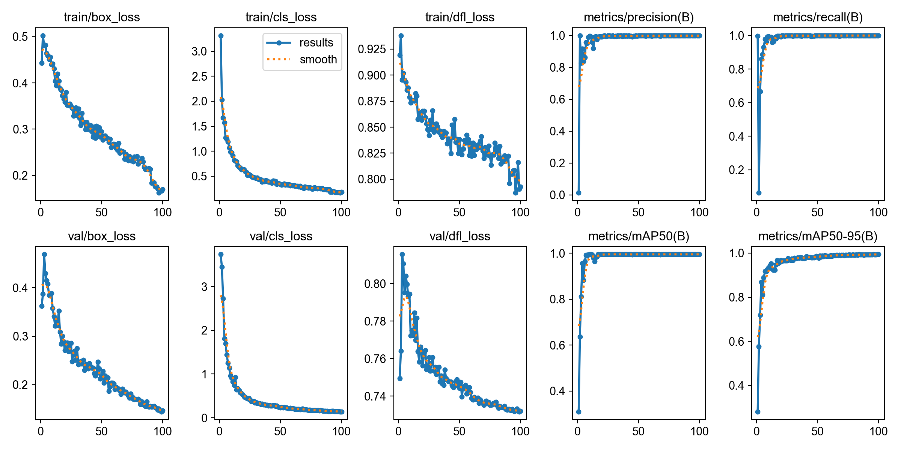
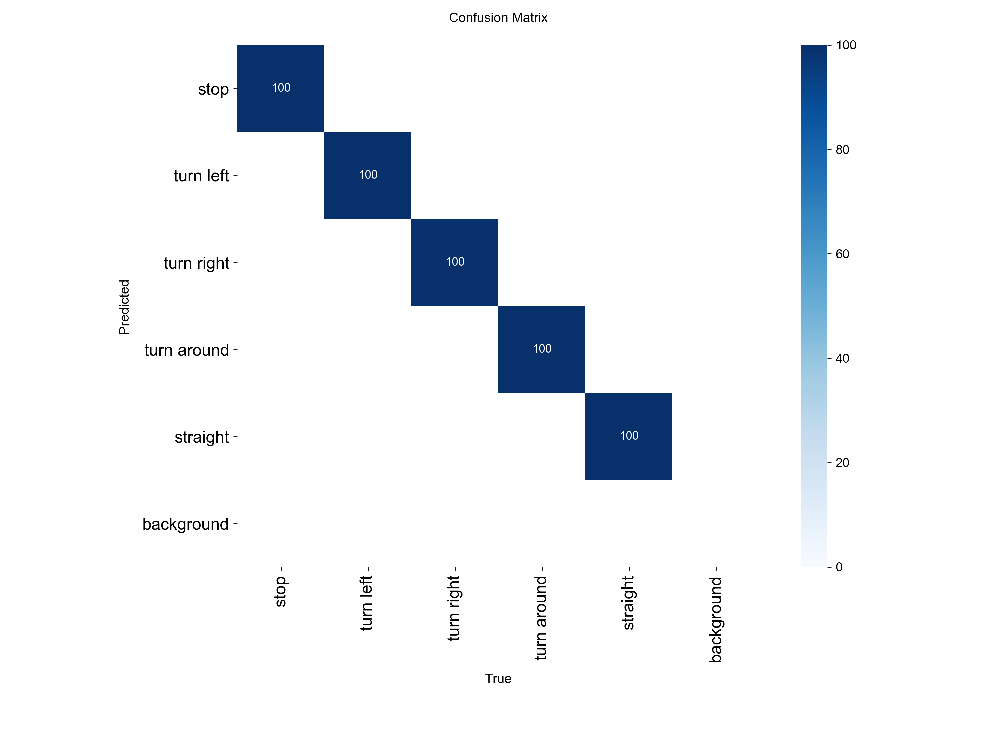
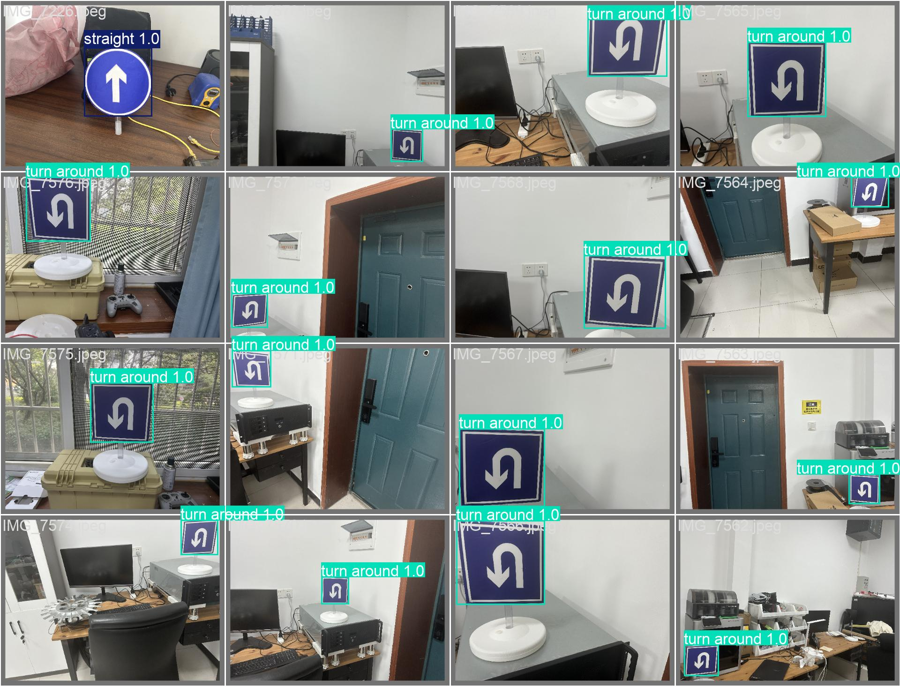

# Traffic Sign Detection and Edge Deployment Analysis (YOLO11n)

## 📑 Table of Contents
- [Project Overview](#-project-overview)
- [Dataset & Model](#-dataset--model)
- [Quick Start](#-quick-start)
- [Training & Evaluation](#-training--evaluation)
- [Edge Deployment: Challenges & Reflection](#️-edge-deployment-challenges--reflection)

---
## 📌 Project Overview
This repository contains the visual perception module for an autonomous vehicle competition. The primary objective is to train a lightweight object detection model (YOLO11n) to identify five categories of traffic signs under varying environmental conditions, and attempt hardware deployment on the Horizon Robotics RDK X5 edge computing board.

## 📊 Dataset & Model
- **Dataset**: 500 real-world images captured from the vehicle's perspective, featuring varying lighting and angles. Fully annotated manually using LabelImg.
- **Model Architecture**: Ultralytics YOLO11n. Selected for its compact parameter size, making it theoretically suitable for the computational constraints of edge NPU devices.

## 🚀 Quick Start
Requirements: Python 3.9+ and PyTorch.

```bash
# Clone the repository
git clone [https://github.com/chenyuma1029/yolo-traffic-sign-detection.git](https://github.com/chenyuma1029/yolo-traffic-sign-detection.git)
cd yolo-traffic-sign-detection

# Install dependencies
pip install -r requirements.txt

# Run inference (requires pre-trained weights in /weights)
python scripts/inference.py
```

## 📈 Training & Evaluation
The model was trained for 100 epochs using MPS acceleration, showing stable convergence. 

### Training Metrics

*Loss curves and mAP metrics indicating stable model convergence.*

### Confusion Matrix

*Performance distribution across the 5 target classes.*

### Inference Preview

*Sample detection bounding boxes and confidence scores on the validation set.*

## 🛠️ Edge Deployment: Challenges & Reflection
The initial project scope included converting the PyTorch model (`.pt`) to a binary format (`.bin`) for hardware inference on the Horizon RDK X5 board. However, compatibility issues arose during the cross-compilation phase.

**Analysis of Deployment Failure:**
Errors occurred during the model conversion process using the official Horizon OpenExplorer toolchain. The probable cause is that YOLO11n, being a relatively new architecture, contains specific operators or activation functions that are not yet fully supported by the target hardware's static quantization compiler (BPU). This resulted in conversion failure before deployment.

**Future Work:**
1. Conduct control experiments using older, hardware-friendly architectures (e.g., YOLOv5s) to verify toolchain compatibility.
2. Review the OpenExplorer documentation to identify unsupported ONNX nodes and manually modify the network architecture prior to export.
